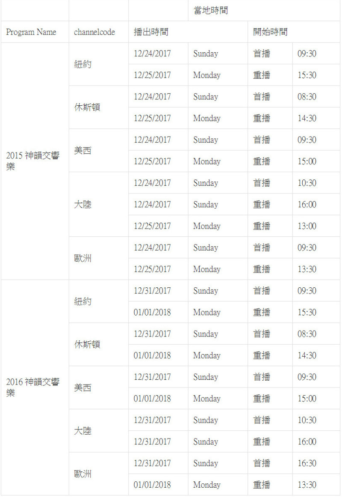
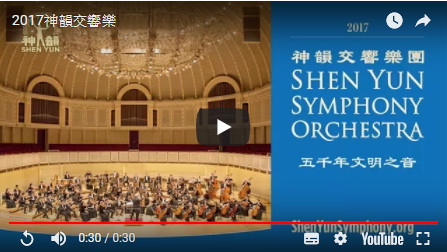
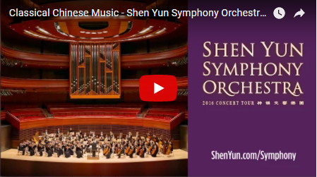

+ <a href='https://github.com/no1show/show1/blob/master/fanQing/wujieliulan_android_4.1_20171123.zip?raw=true'>无界翻墙软件</a>
    - <a href='https://github.com/no1show/show1/blob/master/fanQing/wujieliulan_android_4.1_20171123.zip?raw=true'>安卓版4.1</a>
    - [桌机版17.04](https://github.com/no1show/show1/blob/master/fanQing/wujieliulan_desktop_17.04_20171112/u1704.zip?raw=true)  
+ <a href='https://github.com/no1show/show1/blob/master/fanQing/zi_you_men_android_3.2.zip?raw=true'>自由门翻墙软件</a>
    - <a href='https://github.com/no1show/show1/blob/master/fanQing/zi_you_men_android_3.2.zip?raw=true'>安卓版3.2</a>
    - <a href='https://github.com/no1show/show1/blob/master/fanQing/zi_you_men_7.62_desktop.zip?raw=true'>桌机版7.62</a>
+ <a href='https://github.com/no1show/show1/blob/master/fanQing/Green_iPPOTV.exe?raw=true'>爱博电视PC版</a>   
+ <a href='https://github.com/no1show/show1/blob/master/fanQing/iNTD_TVsp1.apk?raw=true'>新唐人安卓版</a>
    - <a href='https://github.com/no1show/show1/blob/master/fanQing/iNTD_TVsp1.apk?raw=true'>新唐人安卓版2.1.12sp1 下载(大陆有程序被自动删除或隐藏的安卓产品)</a>
    - <a href='https://github.com/no1show/show1/blob/master/fanQing/iNTD_TV.apk?raw=true'>新唐人安卓版2.1.12 

<table border="0" cellspacing="3" cellpadding="3">
<tbody>
<tr>
<td align="center"></td>
</tr>
<tr>
<td align="center"><a href="https://github.com/syshow/5tuan/blob/master/5tuan.md">神韵艺术团是全球顶级中国古典舞与传统音乐艺术团。2006年成立于美国纽约，神韵艺术团云集了大批菁英艺术家，为恢复与弘扬中国传统文化艺术，不断缔造新的奇蹟与辉煌，倍受世人瞩目。</a></td>
</tr>
</tbody>
</table> 

<h1 align="center"><b>新唐人直播预告：2018跨年缤纷夜</b></h1>
  
 
 【新唐人北京时间2017年12月24日讯】在2017年即将过去、2018年到来之际，新唐人电视台特别企划《2018跨年缤纷夜》直播特别节目，在2017年的最后一个夜晚，12月31日陪伴观众盘点年度大事件，欢欢喜喜迎新年。

从全球灿烂烟火、跨年倒数计时中，再见2017 哈罗2018！新唐人2018跨年缤纷夜，跨时代也跨国际，让您耳目一新！
先到唐朝吃国际美食，再与韩星一起搬炭送暖。还有神医孙思邈直播健康1+1；从传统习俗，圣诞节庆台湾纽约比一比；到走入美食天堂，传奇时代，一千步的缤纷台湾。

通过跨年烟火，跨国接力，在时代广场一起倒数，迎接2018，新唐人电视台陪伴您许下新年的第一个愿望。

新唐人《2018跨年缤纷夜》播出时间： 
美东时间12/31(日)21:00开始 
北京时间01/01(一)10:00开始 

电视直播：
新唐人美东、国际、欧洲、中国、亚太等电视频道同步播出

网络直播:

1. 新唐人网站：ntdtv.com
2. YouTube直播：
youtube.com/NTDCHINESE
3. 新唐人脸书直播：
facebook.com/NTDCHINESE
4. 手机观看：
iPhone与Android免费下载 iNTD

<h1 align="center"><b>【新唐人独家播出】神韵交响乐团圣诞和新年音乐会</b></h1>

【新唐人北京时间2017年12月21日讯】圣诞节及新年期间（12月24日至1月1日），新唐人电视台将独家播出神韵交响乐音乐会过去两年（2015年和2016年）巡演的节目。

2015年神韵交响乐音乐会的首播时间（纽约时间）：12月24日（周日）早上9点半，重播时间为12月25日（周一）下午3点；2016年音乐会的首播时间（纽约时间）：12月31日（周日）晚上9点半，重播时间为2018年1月1日（周一）下午3点半；时长90分钟。各地播放时间请参看以下列表。

神韵交响乐团以完整的西方管弦乐队的弦乐、木管及铜管乐器为基础，并以二胡、琵琶及中国打击乐等古老东方乐器为领奏，搭配西方经典曲目，将中国音乐的精神与韵味和西方交响乐团的精准、力度完美结合，创造出令人耳目一新的乐章，将带给您前所未有的感动和启迪，敬请收看。

2012年，神韵交响乐团在纽约卡内基音乐厅举行全球首演获得成功后连年巡演。今年9月17日，神韵交响乐团在亚洲开启了2017年巡演，先后在韩国、台湾、加拿大和美国的多个城市演出二十余场，受到广大观众的追捧和赞誉。

纽约观众可以通过以下任何一种途径收看到新唐人电视台：威讯（Verizon）478频道，无线数字频道（WMBC）63.5，有线电视（Cablevision）1151频道，（Spectrum TV) 1416频道。

其他地区观众可以通过当地频道观看。

2017神韵交响乐巡演预告片：

 <A HREF="download/2017symusic.mp4?raw=true"><a>

2016年神韵交响乐巡演预告片： 
<A HREF="download/Classical Chinese Music - Shen Yun Symphony Orchestra 2016 Trailer.mp4?raw=true"><a>

（责任编辑：明轩）

+ <a href='https://github.com/no1show/show1/blob/master/fanQing/wujieliulan_android_4.1_20171123.zip?raw=true'>无界翻墙软件</a>
    - <a href='https://github.com/no1show/show1/blob/master/fanQing/wujieliulan_android_4.1_20171123.zip?raw=true'>安卓版4.1</a>
    - [桌机版17.04](https://github.com/no1show/show1/blob/master/fanQing/wujieliulan_desktop_17.04_20171112/u1704.zip?raw=true)  
+ <a href='https://github.com/no1show/show1/blob/master/fanQing/zi_you_men_android_3.2.zip?raw=true'>自由门翻墙软件</a>
    - <a href='https://github.com/no1show/show1/blob/master/fanQing/zi_you_men_android_3.2.zip?raw=true'>安卓版3.2</a>
    - <a href='https://github.com/no1show/show1/blob/master/fanQing/zi_you_men_7.62_desktop.zip?raw=true'>桌机版7.62</a>
+ <a href='https://github.com/no1show/show1/blob/master/fanQing/Green_iPPOTV.exe?raw=true'>爱博电视PC版</a>   
+ <a href='https://github.com/no1show/show1/blob/master/fanQing/iNTD_TVsp1.apk?raw=true'>新唐人安卓版</a>
    - <a href='https://github.com/no1show/show1/blob/master/fanQing/iNTD_TVsp1.apk?raw=true'>新唐人安卓版2.1.12sp1 下载(大陆有程序被自动删除或隐藏的安卓产品)</a>
    - <a href='https://github.com/no1show/show1/blob/master/fanQing/iNTD_TV.apk?raw=true'>新唐人安卓版2.1.12 下载(海外产的安卓产品，及大陆不存在程序被自动删除的安卓产品)</a> 
    

<a href="http://111.243.35.205"> 
